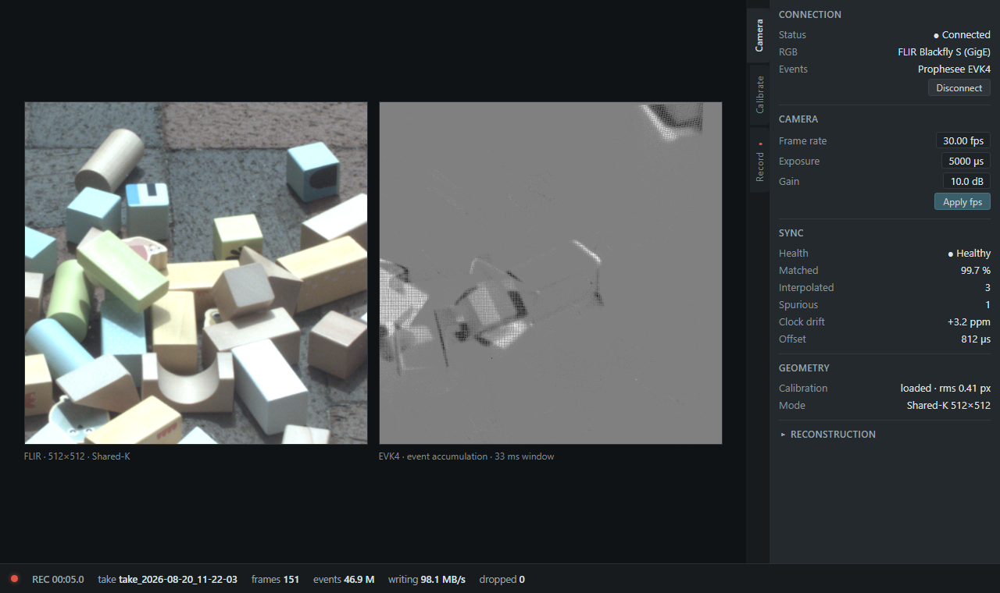

# Fusion Studio

Camera synchronization, calibration, and RGB/event capture for FLIR and Prophesee cameras.



## Run

Requires Windows, Rust (MSVC), LLVM, OpenCV 4.12, Spinnaker SDK, Metavision SDK 5.0, and CUDA 12.6. HEVC recording also requires FFmpeg with NVENC support.

Set your SDK paths in `.cargo/config.toml` and `scripts/env.ps1`, then run from this directory:

```powershell
. .\scripts\env.ps1
cargo run --release -p fs-app -- live
```
